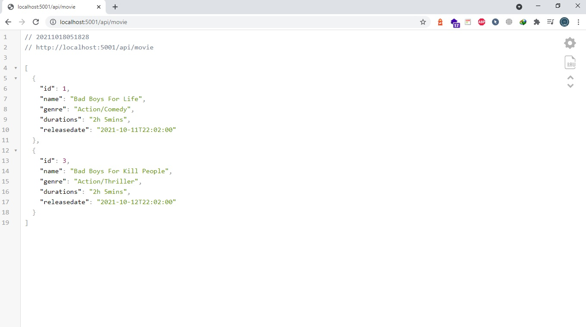
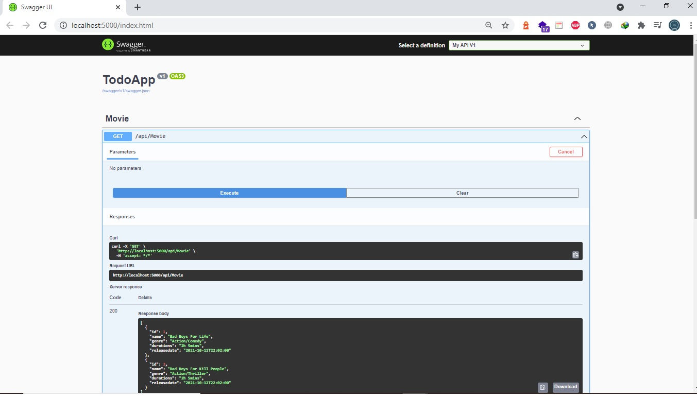

<!DOCTYPE html>
<html lang="en">

<head>
  <meta charset="UTF-8">
  <meta name="viewport" content="width=device-width, initial-scale=1.0">
  <link rel="stylesheet" href="https://cdn.jsdelivr.net/npm/bootstrap@4.6.0/dist/css/bootstrap.min.css"
    integrity="sha384-B0vP5xmATw1+K9KRQjQERJvTumQW0nPEzvF6L/Z6nronJ3oUOFUFpCjEUQouq2+l" crossorigin="anonymous">
</head>

<body>
  <h1>Documentation</h1>
  <h2>ASP.NET Web API</h2>
  

    ASP.NET Web API merupakan implementasi RESTful API service, adalah application program interface (API) yang
    menggunakan HTTP request untuk melakukan GET, PUT, POST dan DELETE data. RESTful API Service ini biasanya diakses
    oleh aplikasi client seperti aplikasi desktop atau aplikasi web, tapi umumnya lebih sering digunakan oleh aplikasi
    mobile.
  

  

    Langkah - langkah untuk menjalankan program :
  

  <ol>
    <li>Buka Folder Project ini menggunakan Visual Studio Community 2019</li>
    <li>Klik run, atau tanda panah di dalam aplikasi Visual Studio Community 2019</li>
    <li>Jika berhasil maka akan tampil seperti dibawah ini</li>
    
    <li>Kemudian untuk Menggunakan Data, Kita bisa menggunkan Aplikasi POSTMAN untuk Mengelolah datanya</li>
    <li>Buka Postman, dan gunakan Method GET pada aplikasi Postman dan ketik url berikut :
      <b>http://localhost:5001/api/movie</b></li>
    
Jika berhasil akan tampil seperti dibawah ini : 

    
    <li>Kemudian untuk Menambahkan data Api, Buka aplikasi Postman dan gunakan Method POST serta ketikkan url berikut :
      <b>http://localhost:5001/api/movie</b>. pada bagian body, klik raw dan ubah tipenya menjadi JSON. Terakhir isi
      datanya</li>
    
    <li>Jika kita ingin Menghapus data, Maka kita ketik : http://localhost:5001/api/movie/{id yang ingin dihapus}
      
Contoh http://localhost:5001/api/movie/2 

    </li>
    
    <li>Kita juga bisa menguji data Api ini menggunakan <b>SWAGGER</b>
      
Caranya ketikkan di url browser : http://localhost:5001/swagger/index.html

    </li>
    

  </ol>
</body>

</html>