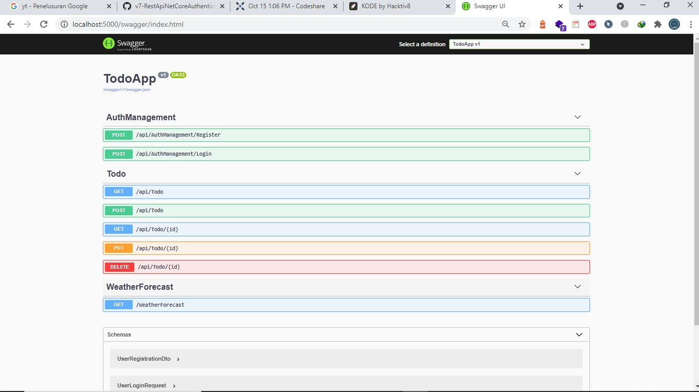

<!doctype html>
<html lang="en">

<head>
  <!-- Required meta tags -->
  <meta charset="utf-8">
  <meta name="viewport" content="width=device-width, initial-scale=1, shrink-to-fit=no">

  <!-- Bootstrap CSS -->
  <link rel="stylesheet" href="https://cdn.jsdelivr.net/npm/bootstrap@4.6.0/dist/css/bootstrap.min.css"
    integrity="sha384-B0vP5xmATw1+K9KRQjQERJvTumQW0nPEzvF6L/Z6nronJ3oUOFUFpCjEUQouq2+l" crossorigin="anonymous">

  <title>Hello, world!</title>
</head>

<body>
  <h1>Documentation</h1>
  <h2>Langkah langkah Menjalankan Program Rest API menggunkan ASP.NET Core 5</h2>
  <ol>
    <li>Buka Terminal, ketik : <b>dotnet build</b></li>
    <li>Kemudian jalankan server dengan mengetik <b>dotnet run</b></li>
    <li>Setelah berhasil dijalankan akses url : https://localhost:5001/api/todo</li>
    <li>Untuk mengolah data, Buka postman dan masukkan url diatas</li>
    <li>Kita bisa melakukan Penambahan data, Pengubahan data, Membaca data serta menghapus data menggunakan Postman
    </li>
    <li>Jika berhasil maka akan tampil seperti berikut : </li>
    
    <li>Tampilan GET data menggunakan POSTMAN</li>
    
    <li>Tampilan POST data menggunakan POSTMAN</li>
    
    <li>Tampilan PUT data menggunakan POSTMAN</li>
    
    <li>Tampilan DELETE data menggunakan POSTMAN</li>
    
    <li>Tampilan GET data berdasarkan Id menggunakan POSTMAN</li>
    
    <li>Tampilan POST data Authentication menggunakan POSTMAN</li>
    
    <li>Tampilan POST data Login menggunakan POSTMAN</li>
    
    <li>Tampilan Tidak bisa login jika belum Terauthentikasi menggunakan POSTMAN</li>
    
    <li>Tampilan Berhasil Login Menggunakan JWT Token menggunakan POSTMAN</li>
    
    <li>Tampilan Menguji Data Api Menggunakan Swagger</li>
    
  </ol>
</body>

</html>